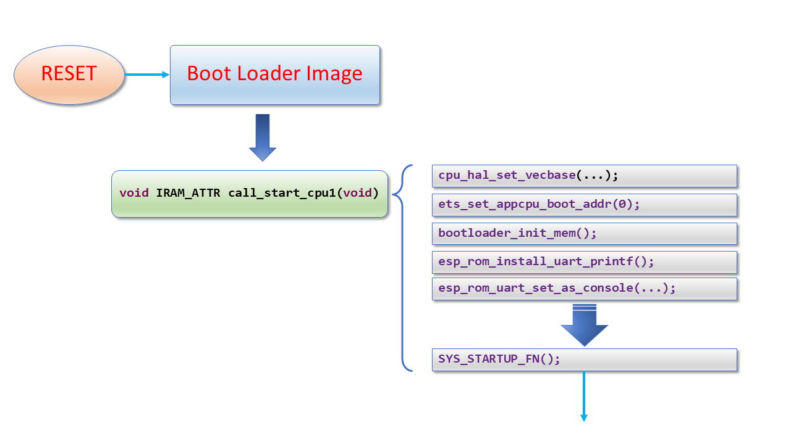
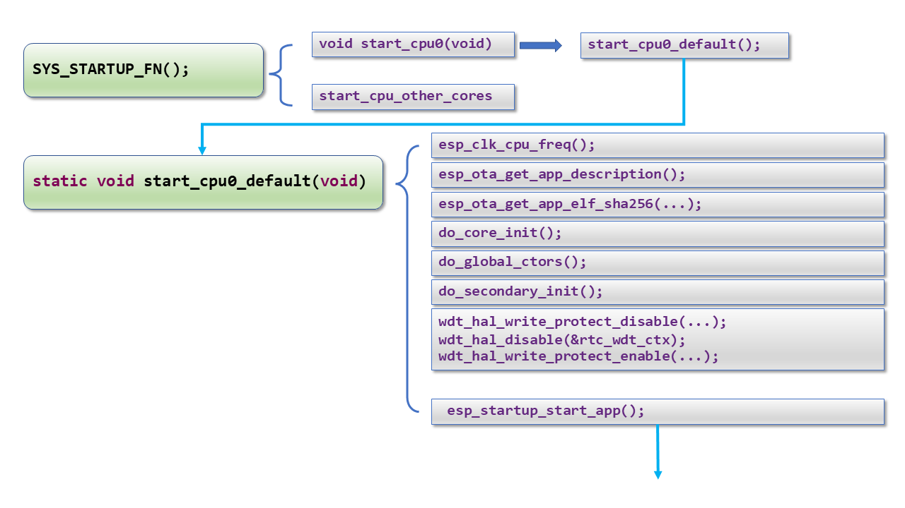
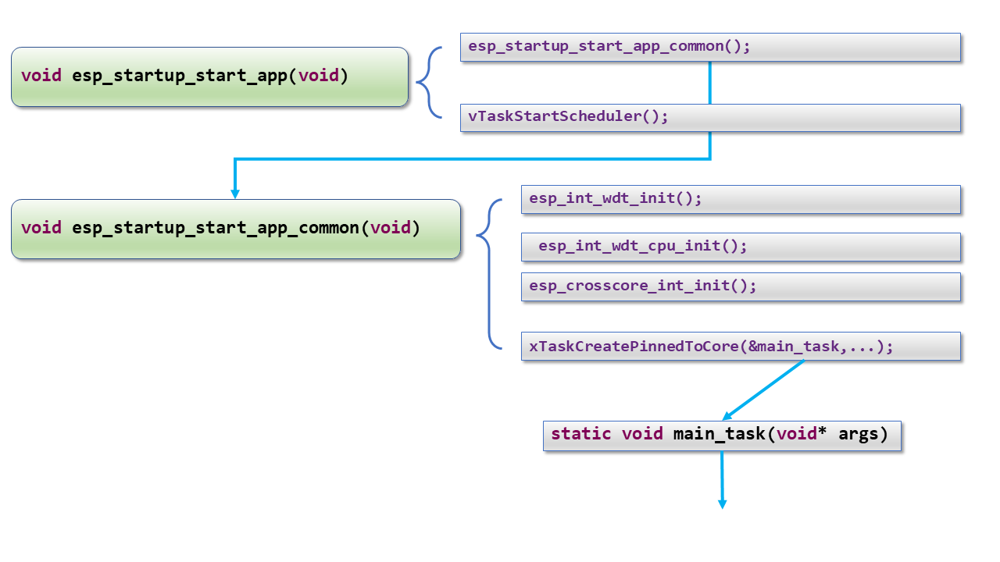
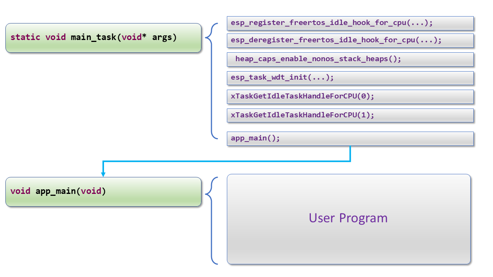

# ESP32-Boot-Process
การทำงานของ ESP32 ตั้งแต่ reset จนถึง app_main()

## คลิปอธิบาย

[](https://youtu.be/ZeurWDMKVDc "ESP32 Boot Process ตั้งแต่ Reset จนถึง app_main()")


## ตัวอย่าง output 

``` 
โ��[0;33m--- idf_monitor on \\.\COM5 115200 ---โ��[0m
--- Quit: Ctrl+] | Menu: Ctrl+T | Help: Ctrl+T followed by Ctrl+H ---
ets Jul 29 2019 12:21:46

rst:0x1 (POWERON_RESET),boot:0x13 (SPI_FAST_FLASH_BOOT)
configsip: 0, SPIWP:0xee
clk_drv:0x00,q_drv:0x00,d_drv:0x00,cs0_drv:0x00,hd_drv:0x00,wp_drv:0x00
mode:DIO, clock div:2
load:0x3fff0030,len:6668
ho 0 tail 12 room 4
load:0x40078000,len:14944
load:0x40080400,len:3816
0x40080400: _init at ??:?

entry 0x40080698
I (29) boot: ESP-IDF v4.4.4-dirty 2nd stage bootloader
I (29) boot: compile time 21:24:08
I (29) boot: chip revision: v3.0
I (33) boot_comm: chip revision: 3, min. bootloader chip revision: 0
I (40) boot.esp32: SPI Speed      : 40MHz
I (44) boot.esp32: SPI Mode       : DIO
I (49) boot.esp32: SPI Flash Size : 2MB
I (54) boot: Enabling RNG early entropy source...
I (59) boot: Partition Table:
I (62) boot: ## Label            Usage          Type ST Offset   Length
I (70) boot:  0 nvs              WiFi data        01 02 00009000 00006000
I (77) boot:  1 phy_init         RF data          01 01 0000f000 00001000
I (85) boot:  2 factory          factory app      00 00 00010000 00100000
I (92) boot: End of partition table
I (96) boot_comm: chip revision: 3, min. application chip revision: 0
I (103) esp_image: segment 0: paddr=00010020 vaddr=3f400020 size=0786ch ( 30828) map
I (123) esp_image: segment 1: paddr=00017894 vaddr=3ffb0000 size=023e0h (  9184) load
I (127) esp_image: segment 2: paddr=00019c7c vaddr=40080000 size=0639ch ( 25500) load
I (142) esp_image: segment 3: paddr=00020020 vaddr=400d0020 size=148f4h ( 84212) map
I (172) esp_image: segment 4: paddr=0003491c vaddr=4008639c size=054ech ( 21740) load
I (187) boot: Loaded app from partition at offset 0x10000
I (187) boot: Disabling RNG early entropy source...
I (199) cpu_start: Pro cpu up.
I (199) cpu_start: Starting app cpu, entry point is 0x4008102c
0x4008102c: call_start_cpu1 at C:/Espressif/frameworks/esp-idf-v4.4.4/components/esp_system/port/cpu_start.c:148

I (0) cpu_start: App cpu up.
I (213) cpu_start: Pro cpu start user code
I (213) cpu_start: cpu freq: 160000000
I (213) cpu_start: Application information:
I (218) cpu_start: Project name:     main
I (223) cpu_start: App version:      a029e3f-dirty
I (228) cpu_start: Compile time:     Feb 12 2023 21:23:38
I (234) cpu_start: ELF file SHA256:  6d1118ab59730511...
I (240) cpu_start: ESP-IDF:          v4.4.4-dirty
I (246) heap_init: Initializing. RAM available for dynamic allocation:
I (253) heap_init: At 3FFAE6E0 len 00001920 (6 KiB): DRAM
I (259) heap_init: At 3FFB2CC8 len 0002D338 (180 KiB): DRAM
I (265) heap_init: At 3FFE0440 len 00003AE0 (14 KiB): D/IRAM
I (271) heap_init: At 3FFE4350 len 0001BCB0 (111 KiB): D/IRAM
I (278) heap_init: At 4008B888 len 00014778 (81 KiB): IRAM
I (285) spi_flash: detected chip: generic
I (289) spi_flash: flash io: dio
W (293) spi_flash: Detected size(4096k) larger than the size in the binary image header(2048k). Using the size in the binary image header.
I (307) cpu_start: Starting scheduler on PRO CPU.
I (0) cpu_start: Starting scheduler on APP CPU.

```
## Slides












